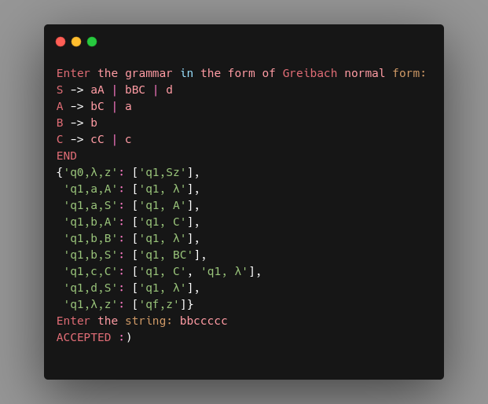

# PDA (Pushdown Automaton)
### How does it work?
First, when you run the code, you'll be asked to input your grammar in the form of Greibach (read more about Greibach Normal Form [here](https://www.google.com)). By typing END, you'll notice the program that inputting the grammar finished.

Afterward, you'll bump into the list of transition functions extracted from the input grammar. Now it's time to input the string that you wish to check by the PDA constructed by your grammar!

Let's see two examples of this program:

Accepted by PDA | Not accepted by PDA
:------------------------:|:------------------------:
|
